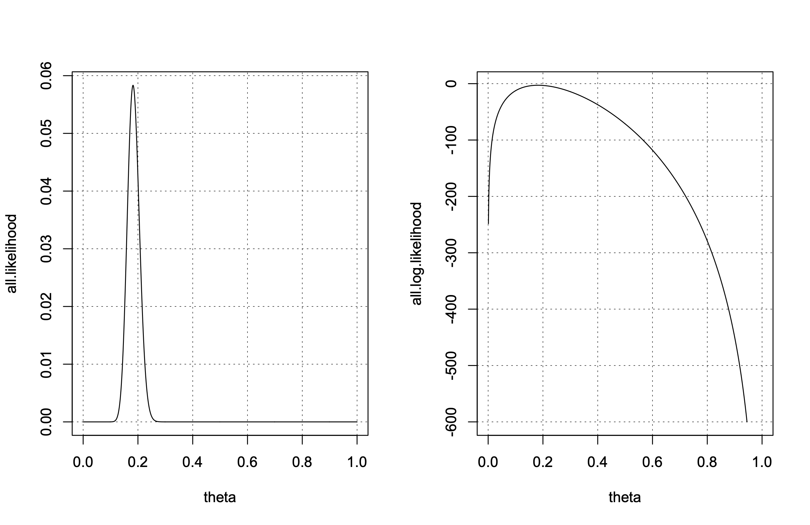
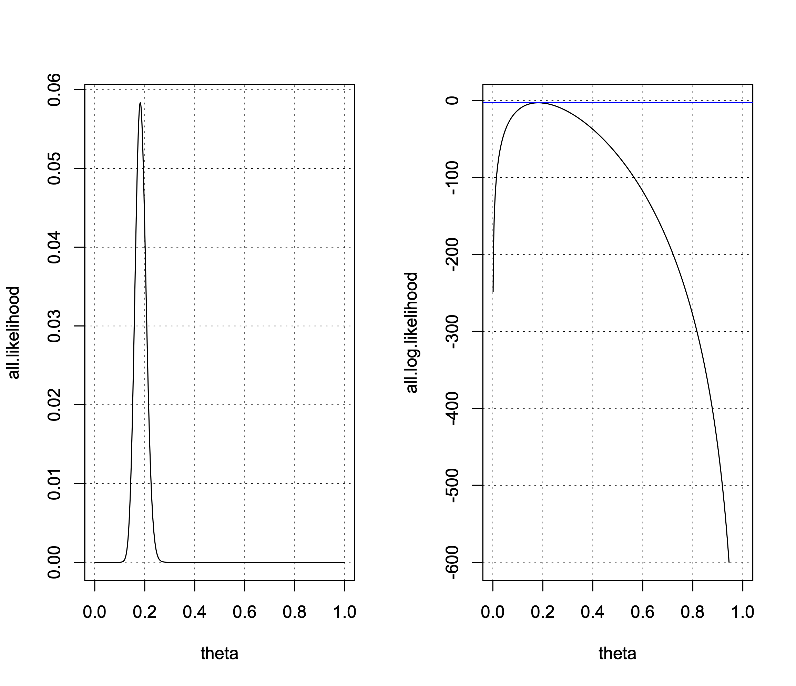

## Lesson 3 - Thursday 9/15/22

### A. Ambiguity in Assignment Given Last Week 

* Before you can calculate a confidence interval, it is important to calculate the correct standard error.
* Be sure to review the correct formula for the standard error for the problem you are working on.

### B. Consistency

We now consider a situation where a small sample estimator is biased but the bias diminishes as the sample size grows larger. Based on the NCVS, we would expect that rural households have a lower victimization risk. So, let's suppose we have a (1M) population of urban and rural households and a disparity in victimization risk that approximates what we see in the NCVS. Here is the R code:

```R
options(scipen=100000)
set.seed(394320258)
urban <- rbinom(n=1000000,size=1,prob=0.65)
z <- runif(n=1000000,min=0,max=1)
u <- log(z/(1-z))
ystar <- 0.5*urban+u
y <- rep(NA,1000000)
y[ystar>0] <- 1
y[ystar<0] <- 0
pop.df <- data.frame(y,urban)
table(pop.df$y,pop.df$urban)
pop.lr.model <- glm(y~1+urban,data=pop.df,family="binomial")
summary(pop.lr.model)
popoddsratio <- exp(coef(pop.lr.model)[2])
popoddsratio

# now, let's sample from the population [nsamples] times
# using a relatively small sample of size N = 50
# we will call this the small sample size

nsamples <- 10000
sampsize <- 50

urban.coef.small <- vector()

for(i in 1:nsamples)
  {
   sdf <- pop.df[sample(nrow(pop.df),size=sampsize,replace=T), ]
   small.logit <- glm(y~1+urban,data=sdf,family="binomial")
   urban.coef.small[i] <- exp(coef(small.logit)[2])
   }

# let's look at the results for the last sample

summary(small.logit)

# calculate results

mean(urban.coef.small)

# next, we use a sample that is 5x larger (N = 250)
# we will call this a medium sample size

nsamples <- 10000
sampsize <- 250

urban.coef.medium <- vector()

for(i in 1:nsamples)
  {
   sdf <- pop.df[sample(nrow(pop.df),size=sampsize,replace=T), ]
   medium.logit <- glm(y~1+urban,data=sdf,family="binomial")
   urban.coef.medium[i] <- exp(coef(medium.logit)[2])
   }

# let's look at the results for the last sample

summary(medium.logit)

# calculate results

mean(urban.coef.medium)

# now we will use a large sample size of N = 1000

nsamples <- 10000
sampsize <- 1000

urban.coef.large <- vector()

for(i in 1:nsamples)
  {
   sdf <- pop.df[sample(nrow(pop.df),size=sampsize,replace=T), ]
   large.logit <- glm(y~1+urban,data=sdf,family="binomial")
   urban.coef.large[i] <- exp(coef(large.logit)[2])
   }

# let's look at the results for the last sample

summary(large.logit)

# calculate results

mean(urban.coef.large)
```

and here is the output:

```Rout
> options(scipen=100000)
> set.seed(394320258)
> urban <- rbinom(n=1000000,size=1,prob=0.65)
> z <- runif(n=1000000,min=0,max=1)
> u <- log(z/(1-z))
> ystar <- 0.5*urban+u
> y <- rep(NA,1000000)
> y[ystar>0] <- 1
> y[ystar<0] <- 0
> pop.df <- data.frame(y,urban)
> table(pop.df$y,pop.df$urban)
   
         0      1
  0 174762 245504
  1 175537 404197
> pop.lr.model <- glm(y~1+urban,data=pop.df,family="binomial")
> summary(pop.lr.model)

Call:
glm(formula = y ~ 1 + urban, family = "binomial", data = pop.df)

Deviance Residuals: 
    Min       1Q   Median       3Q      Max  
-1.3951  -1.1793   0.9743   0.9743   1.1755  

Coefficients:
            Estimate Std. Error z value            Pr(>|z|)
(Intercept) 0.004425   0.003379   1.309                0.19
urban       0.494164   0.004239 116.585 <0.0000000000000002
               
(Intercept)    
urban       ***
---
Signif. codes:  
0 ‘***’ 0.001 ‘**’ 0.01 ‘*’ 0.05 ‘.’ 0.1 ‘ ’ 1

(Dispersion parameter for binomial family taken to be 1)

    Null deviance: 1360755  on 999999  degrees of freedom
Residual deviance: 1347136  on 999998  degrees of freedom
AIC: 1347140

Number of Fisher Scoring iterations: 4

> popoddsratio <- exp(coef(pop.lr.model)[2])
> popoddsratio
   urban 
1.639128 
> 
> # now, let's sample from the population [nsamples] times
> # using a relatively small sample of size N = 50
> # we will call this the small sample size
> 
> nsamples <- 10000
> sampsize <- 50
> 
> urban.coef.small <- vector()
> 
> for(i in 1:nsamples)
+   {
+    sdf <- pop.df[sample(nrow(pop.df),size=sampsize,replace=T), ]
+    small.logit <- glm(y~1+urban,data=sdf,family="binomial")
+    urban.coef.small[i] <- exp(coef(small.logit)[2])
+    }
> 
> # let's look at the results for the last sample
> 
> summary(small.logit)

Call:
glm(formula = y ~ 1 + urban, family = "binomial", data = sdf)

Deviance Residuals: 
   Min      1Q  Median      3Q     Max  
-1.302  -1.302   1.058   1.058   1.354  

Coefficients:
            Estimate Std. Error z value Pr(>|z|)
(Intercept)  -0.4055     0.5270  -0.769    0.442
urban         0.6931     0.6280   1.104    0.270

(Dispersion parameter for binomial family taken to be 1)

    Null deviance: 69.235  on 49  degrees of freedom
Residual deviance: 67.994  on 48  degrees of freedom
AIC: 71.994

Number of Fisher Scoring iterations: 4

> 
> # calculate results
> 
> mean(urban.coef.small)
[1] 2.068656
> 
> # next, we use a sample that is 5x larger (N = 250)
> # we will call this a medium sample size
> 
> nsamples <- 10000
> sampsize <- 250
> 
> urban.coef.medium <- vector()
> 
> for(i in 1:nsamples)
+   {
+    sdf <- pop.df[sample(nrow(pop.df),size=sampsize,replace=T), ]
+    medium.logit <- glm(y~1+urban,data=sdf,family="binomial")
+    urban.coef.medium[i] <- exp(coef(medium.logit)[2])
+    }
> 
> # let's look at the results for the last sample
> 
> summary(medium.logit)

Call:
glm(formula = y ~ 1 + urban, family = "binomial", data = sdf)

Deviance Residuals: 
    Min       1Q   Median       3Q      Max  
-1.6325  -1.1097   0.7826   0.7826   1.2466  

Coefficients:
            Estimate Std. Error z value  Pr(>|z|)    
(Intercept)  -0.1613     0.2151  -0.750     0.453    
urban         1.1876     0.2790   4.256 0.0000208 ***
---
Signif. codes:  
0 ‘***’ 0.001 ‘**’ 0.01 ‘*’ 0.05 ‘.’ 0.1 ‘ ’ 1

(Dispersion parameter for binomial family taken to be 1)

    Null deviance: 326.71  on 249  degrees of freedom
Residual deviance: 308.15  on 248  degrees of freedom
AIC: 312.15

Number of Fisher Scoring iterations: 4

> 
> # calculate results
> 
> mean(urban.coef.medium)
[1] 1.705688
> 
> # now we will use a large sample size of N = 1000
> 
> nsamples <- 10000
> sampsize <- 1000
> 
> urban.coef.large <- vector()
> 
> for(i in 1:nsamples)
+   {
+    sdf <- pop.df[sample(nrow(pop.df),size=sampsize,replace=T), ]
+    large.logit <- glm(y~1+urban,data=sdf,family="binomial")
+    urban.coef.large[i] <- exp(coef(large.logit)[2])
+    }
> 
> # let's look at the results for the last sample
> 
> summary(large.logit)

Call:
glm(formula = y ~ 1 + urban, family = "binomial", data = sdf)

Deviance Residuals: 
    Min       1Q   Median       3Q      Max  
-1.3795  -1.2034   0.9879   0.9879   1.1517  

Coefficients:
            Estimate Std. Error z value Pr(>|z|)   
(Intercept)  0.06093    0.10081   0.604  0.54554   
urban        0.40264    0.13086   3.077  0.00209 **
---
Signif. codes:  
0 ‘***’ 0.001 ‘**’ 0.01 ‘*’ 0.05 ‘.’ 0.1 ‘ ’ 1

(Dispersion parameter for binomial family taken to be 1)

    Null deviance: 1363.7  on 999  degrees of freedom
Residual deviance: 1354.2  on 998  degrees of freedom
AIC: 1358.2

Number of Fisher Scoring iterations: 4

> 
> # calculate results
> 
> mean(urban.coef.large)
[1] 1.655039
> 
```

### C. Introduction to Maximum Likelihood

* Enter some data.

```R
# key in dataset from Berk and Sherman (1988)
# JASA, 83:70-76.

n.treat <- 92
n.fail.treat <- 10

n.control <- 221
n.fail.control <- 47
```

* First inferential goal is to estimate p(fail):

```R
# likelihood function
# p(r|theta, N) = (N choose r) theta^r (1-theta)^(N-r)
# where (N choose r) = N!/[r!(N-r)!]

theta <- seq(from=0,to=1,by=0.001)

# find maximum likelihood estimate of theta 
# for the entire sample

p1.all <- choose(n.treat+n.control,n.fail.treat+n.fail.control)
p2.all <- theta^(n.fail.treat+n.fail.control)
p3.all <- (1-theta)^((n.treat+n.control)-(n.fail.treat+n.fail.control))
all.likelihood <- p1.all*p2.all*p3.all
all.log.likelihood <- log(all.likelihood)
df.all <- data.frame(theta,all.likelihood)
subset(df.all,theta>=0.16 & theta<=0.20)
```

* Here are the results:

```Rout
> # likelihood function
> # p(r|theta, N) = (N choose r) theta^r (1-theta)^(N-r)
> # where (N choose r) = N!/[r!(N-r)!]
> 
> theta <- seq(from=0,to=1,by=0.001)
> 
> # find maximum likelihood estimate of theta 
> # for the entire sample
> 
> p1.all <- choose(n.treat+n.control,n.fail.treat+n.fail.control)
> p2.all <- theta^(n.fail.treat+n.fail.control)
> p3.all <- (1-theta)^((n.treat+n.control)-(n.fail.treat+n.fail.control))
> all.likelihood <- p1.all*p2.all*p3.all
> all.log.likelihood <- log(all.likelihood)
> df.all <- data.frame(theta,all.likelihood)
> subset(df.all,theta>=0.16 & theta<=0.20)
    theta all.likelihood
161 0.160     0.03368063
162 0.161     0.03541448
163 0.162     0.03714228
164 0.163     0.03885569
165 0.164     0.04054621
166 0.165     0.04220525
167 0.166     0.04382419
168 0.167     0.04539449
169 0.168     0.04690774
170 0.169     0.04835575
171 0.170     0.04973064
172 0.171     0.05102488
173 0.172     0.05223139
174 0.173     0.05334359
175 0.174     0.05435546
176 0.175     0.05526161
177 0.176     0.05605730
178 0.177     0.05673851
179 0.178     0.05730194
180 0.179     0.05774507
181 0.180     0.05806613
182 0.181     0.05826417
183 0.182     0.05833897
184 0.183     0.05829113
185 0.184     0.05812199
186 0.185     0.05783361
187 0.186     0.05742875
188 0.187     0.05691086
189 0.188     0.05628398
190 0.189     0.05555273
191 0.190     0.05472226
192 0.191     0.05379815
193 0.192     0.05278643
194 0.193     0.05169344
195 0.194     0.05052580
196 0.195     0.04929038
197 0.196     0.04799417
198 0.197     0.04664428
199 0.198     0.04524786
200 0.199     0.04381203
201 0.200     0.04234385
> 
```

* Now, let's graph the functions (both the likelihood and the log-likelihood functions):

```R
# generate likelihood plots

par(mfrow=c(1,2))

plot(x=theta,y=all.likelihood,type="l",lty=1,lwd=1)
abline(h=seq(from=0,to=0.06,by=0.01),lty=3,lwd=0.5)
abline(v=seq(from=0,to=1,by=0.2),lty=3,lwd=0.5)

plot(x=theta,y=all.log.likelihood,type="l",lty=1,lwd=1)
abline(h=seq(from=-600,to=0,by=100),lty=3,lwd=0.5)
abline(v=seq(from=0,to=1,by=0.2),lty=3,lwd=0.5)
```

<p align="left">

</p>

* Notice that both curves reach their peak at the same location.
* The log transformation is monotone (implying order preservation).
* The next issue that arises is verifying that the log likelihood function is flat in the neighborhood of the maximum. We can check this by calculating the first derivative of the log-likelihood function:

```r
# use finite difference approximation to calculate derivative
# of log-likelihood function

# begin by dividing the number of failures by the number of people

57/313

theta1 <- 0.1821087
thetad <- 0.1821086
theta0 <- 0.1821085

pi1a <- choose(n.treat+n.control,n.fail.treat+n.fail.control)
pi1b <- theta1^(n.fail.treat+n.fail.control)
pi1c <- (1-theta1)^((n.treat+n.control)-(n.fail.treat+n.fail.control))
pi1 <- pi1a*pi1b*pi1c
logpi1 <- log(pi1)

pida <- choose(n.treat+n.control,n.fail.treat+n.fail.control)
pidb <- thetad^(n.fail.treat+n.fail.control)
pidc <- (1-thetad)^((n.treat+n.control)-(n.fail.treat+n.fail.control))
pid <- pida*pidb*pidc
logpid <- log(pid)

pi0a <- choose(n.treat+n.control,n.fail.treat+n.fail.control)
pi0b <- theta0^(n.fail.treat+n.fail.control)
pi0c <- (1-theta0)^((n.treat+n.control)-(n.fail.treat+n.fail.control))
pi0 <- pi0a*pi0b*pi0c
logpi0 <- log(pi0)

# approximate derivative

(logpi1-logpi0)/(theta1-theta0)

# check the result

d <- deriv(~ log(pida*thetad^(n.fail.treat+n.fail.control)*
                 (1-thetad)^((n.treat+n.control)-(n.fail.treat+n.fail.control))), "thetad")
eval(d)
```

* Here are the results of these calculations:

```rout
> # use finite difference approximation to calculate derivative
> # of log-likelihood function
> 
> # begin by dividing the number of failures by the number of people
> 
> 57/313
[1] 0.1821086
> 
> theta1 <- 0.1821087
> thetad <- 0.1821086
> theta0 <- 0.1821085
> 
> pi1a <- choose(n.treat+n.control,n.fail.treat+n.fail.control)
> pi1b <- theta1^(n.fail.treat+n.fail.control)
> pi1c <- (1-theta1)^((n.treat+n.control)-(n.fail.treat+n.fail.control))
> pi1 <- pi1a*pi1b*pi1c
> logpi1 <- log(pi1)
> 
> pida <- choose(n.treat+n.control,n.fail.treat+n.fail.control)
> pidb <- thetad^(n.fail.treat+n.fail.control)
> pidc <- (1-thetad)^((n.treat+n.control)-(n.fail.treat+n.fail.control))
> pid <- pida*pidb*pidc
> logpid <- log(pid)
> 
> pi0a <- choose(n.treat+n.control,n.fail.treat+n.fail.control)
> pi0b <- theta0^(n.fail.treat+n.fail.control)
> pi0c <- (1-theta0)^((n.treat+n.control)-(n.fail.treat+n.fail.control))
> pi0 <- pi0a*pi0b*pi0c
> logpi0 <- log(pi0)
> 
> # approximate derivative
> 
> (logpi1-logpi0)/(theta1-theta0)
[1] 5.505374e-05
> 
> # check the result
> 
> d <- deriv(~ log(pida*thetad^(n.fail.treat+n.fail.control)*
+                  (1-thetad)^((n.treat+n.control)-(n.fail.treat+n.fail.control))), "thetad")
> eval(d)
[1] -2.841473
attr(,"gradient")
           thetad
[1,] 5.505386e-05
> 
```

* Note that we can add a tangent line to the log-likelihood plot space to visually see that the
slope of the tangent line at the maximum of the function is ~0.

```r
# slope for tangent line -- tangent at max[Log(L)] = a + b*thetad

slope.line <- (logpi1-logpi0)/(theta1-theta0)
slope.line

# intercept for line -- a = log(L) - b*thetad

int.line <- -2.841473-slope.line*thetad
int.line

# draw the tangent line through the plotspace

abline(a=int.line,b=slope.line,lty=1,lwd=1,col="blue")
```

* Here are the results:

```r
> # slope for tangent line -- tangent at max[Log(L)] = a + b*thetad
> 
> slope.line <- (logpi1-logpi0)/(theta1-theta0)
> slope.line
[1] 5.505374e-05
> 
> # intercept for line -- a = log(L) - b*thetad
> 
> int.line <- -2.841473-slope.line*thetad
> int.line
[1] -2.841483
> 
> # draw the tangent line through the plotspace
> 
> abline(a=int.line,b=slope.line,lty=1,lwd=1,col="blue")
```

<p align="left">

</p>
